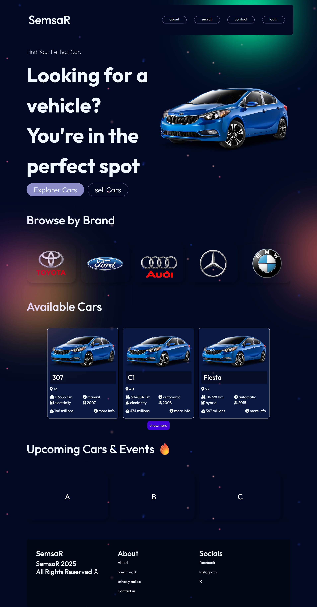
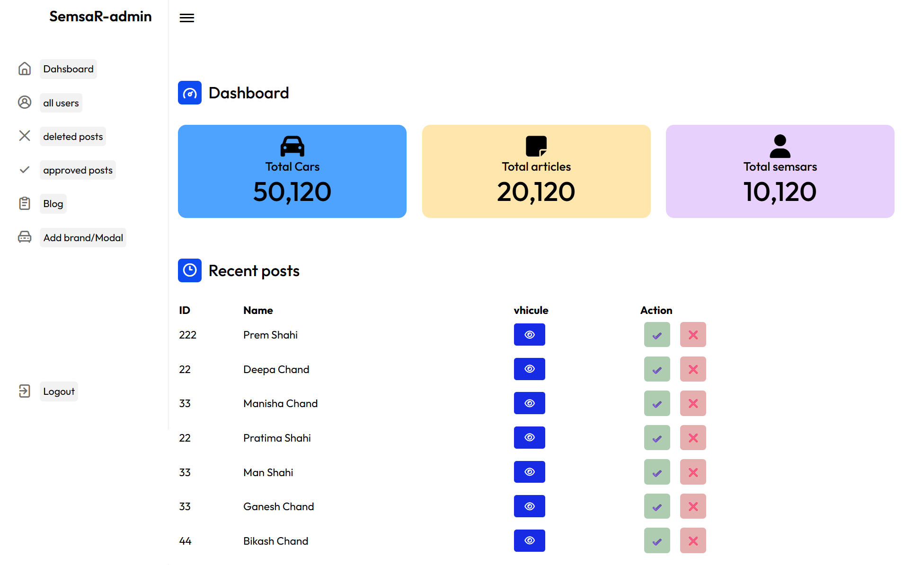
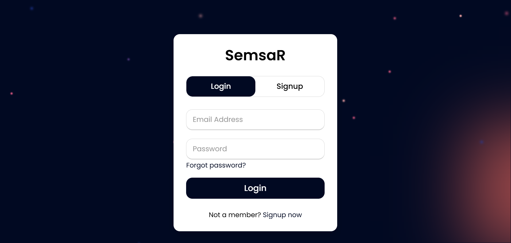

# 🚗 Car Sales Web Application – Final Year Project

A collaborative web application for managing car sales, including user accounts, role-based access (Admin / Client), and CRUD operations on car listings.  
This project was developed as part of our Bachelor's degree final year in Computer Science at the University of Bouira, Algeria.

---

## 📸 Screenshots

  
  
  



---

## 🚀 Features

- 🔑 **Authentication**: Registration, login, secure access  
- 👥 **Role Management**: Admin and User  
- 🚗 **Car Listings**: Add, update, delete, and view available cars  
- 🛒 **Purchase Requests**: Users can send requests to buy a car  
- 📊 **Admin Dashboard**: Manage cars, validate or reject purchase requests, manage users  
- 🎨 **Responsive UI**: Accessible on desktop and mobile  

---

## 🛠️ Technologies Used

- **Backend**: Laravel 11 (developed by Amazigh GUETTAF)  
- **Frontend**: HTML, CSS, JavaScript (developed by Djamel Eddin FAID [ak2djamo])  
- **Database**: MySQL  
- **Styling**: Bootstrap  
- **Tools**: GitHub, Composer, NPM  

---

## ⚙️ Installation & Setup

1. **Clone the repository**
   ```bash
   git clone https://github.com/Guettaf-Mazigh/Sell-buy-cars-c2c.git
   ```
2. **Install backend dependencies**
   ```bash
   composer install
   ```
3. **Install frontend dependencies**
   ```bash
   npm install && npm run dev
   ```
4. **Configure environment**
   ```bash
   cp .env.example .env
   php artisan key:generate
   ```
5. **Run migrations with seeders**
   ```bash
   php artisan migrate --seed
   ```
6. **Start the server**
   ```bash
   php artisan serve
   ```


   **Team**
   <br>
   Amazigh GUETTAF – Backend Developer (Laravel, Database, Authentication, APIs) <br>
   Djamel Eddin FAID [ak2djamo] – Frontend Developer (UI/UX, Design, Integration)
